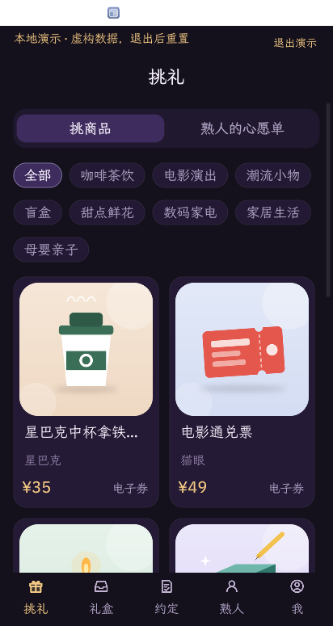
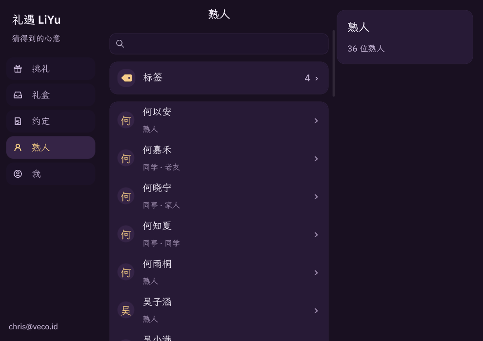
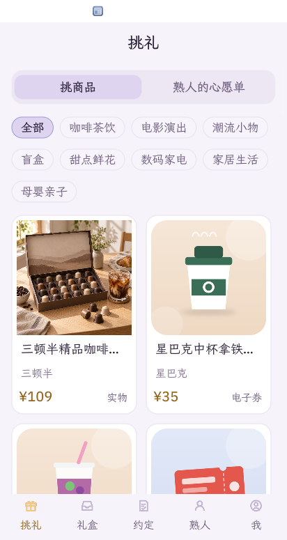
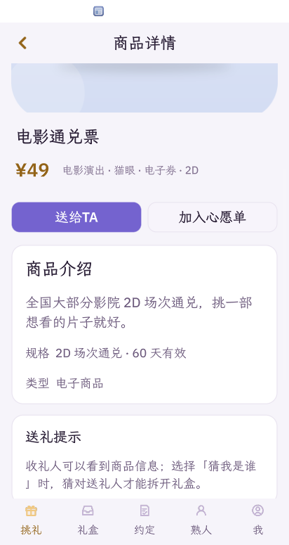
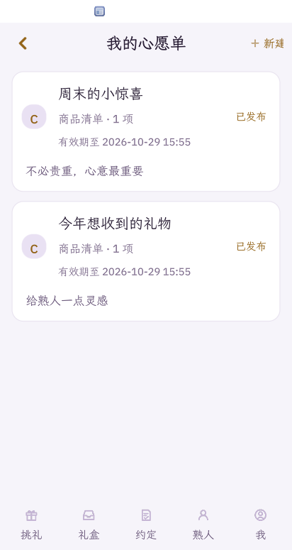
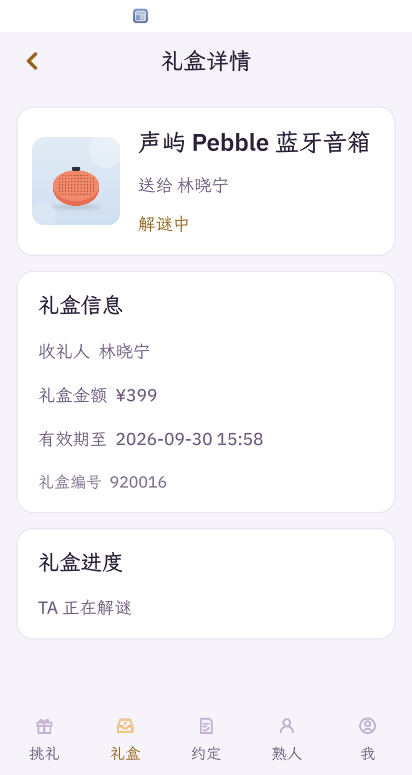
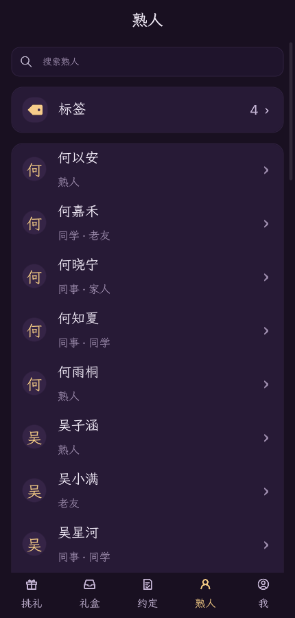
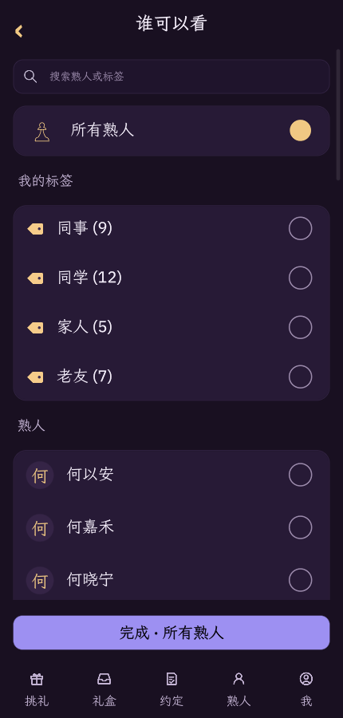
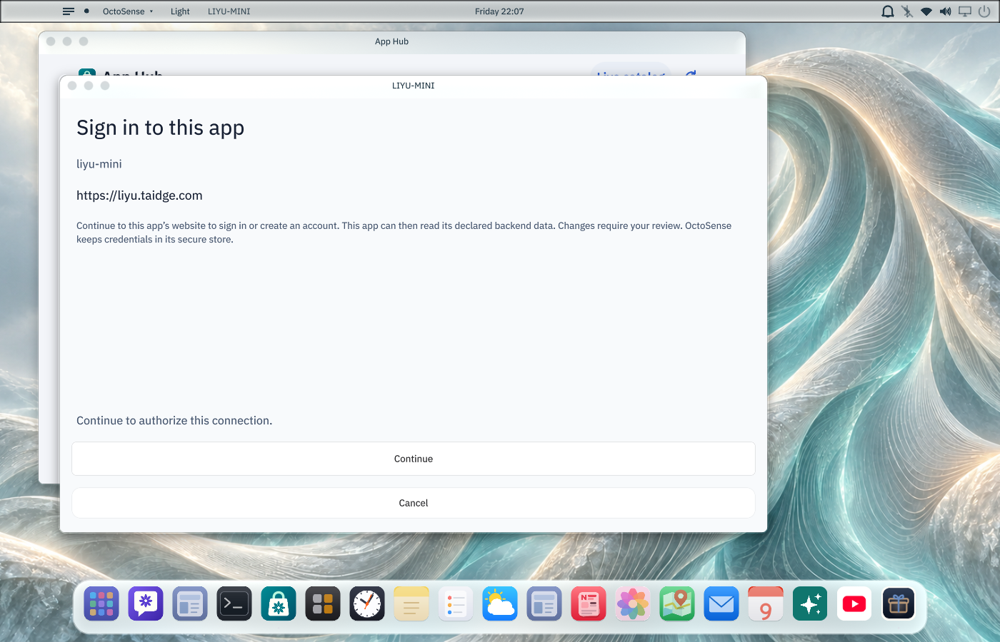

# LIYU-MINI

礼遇是一种围绕熟人关系的社交电商形态：通过心愿单了解需求，用礼盒与解谜让送礼变得有趣，用纪念日提醒和附带约定延续交流。目标是让朋友、伴侣和家人更容易表达关心，增进人与人之间的关系。完整的使用场景、需求、验收标准与未来方向见[产品需求与价值](docs/product-requirements.md)。

LIYU-MINI 是礼遇的 OctoScript / Splash 小程序，使用标准宿主后端连接访问 [liyu-server](https://github.com/chrislearn/liyu-server)，无需专用 `liyu` 宿主服务，也无需安装原生 LIYU。需要兼容 `backend-api-v1` 的宿主，支持真实用户登录，以及无需服务器的本地演示。当前支付、物流和折现为测试流程，不产生真实扣款或提现。

## 主要功能

- **挑礼与送礼**：浏览商品目录和详情，选择商品后点击「送给TA」设置礼盒。提交前核对确认金额，变化时要求重新报价；测试支付后读回订单及礼盒配置，失败可重试原订单。支持添加、移除收礼人，一次最多选择 100 位熟人，合并报价并生成测试订单，每位收礼人对应一个礼盒。
- **主动拆盒**：收到礼盒后可以查看商品信息，送礼人身份在拆盒前隐藏。送礼人可选择直接打开、猜送礼人或回答问题；每个礼盒都必须主动打开，谜题答错不能拆盒。
- **心愿单**：新建心愿单后逐件加入商品，最多 8 项，也可填写商品种类、预算等需求。发布前仅自己可见，发布时设置可见范围和有效期；发布后商品清单固定。重复加入同一商品不会增加重复项。
- **熟人资料与提醒**：保存仅自己可见的昵称、联系方式、关系、生日、结婚日期和备注。生日及结婚纪念日在提前七天和当天产生站内提醒。
- **AI 建议**：在熟人详情点击「AI 帮我挑礼」，重新读取服务端熟人及商品数据，按预算、场合和熟人资料，通过宿主配置的模型推荐目录内商品、购买注意事项和寄语；可将推荐采用为待确认的送礼草稿，未知商品和超预算推荐会被拒绝。也可分析适合赠送的商品，或根据可见线索推测送礼人。AI 无法读取真正答案，也不能替用户拆盒或下单；宿主未提供模型服务时会提示不可用。
- **约定记录**：双方分别记录待兑现、已兑现状态。点击「附带的约定」进入状态页面，修改只影响当前账号的记录。旧版共享状态保留为历史数据。约定日期由一方提出、另一方确认后生效；改期和清除也需确认，等待期间保留原日期。可导出已确认日期为 .ics，手动导入 Apple、Google 或 Outlook 日历；兼容宿主下可选择设备日历，经原生权限与写入确认添加/更新事件，并回读核验；改期需手动更新，不自动同步或删除。
- **账号与地址**：支持修改显示名、验证邮箱或手机号，保存多个收货地址，设置默认地址，以及编辑和删除地址。「我」页面底部提供切换账号和退出登录。
- **外观与布局**：支持深色、浅色主题并保存偏好。手机布局使用底部导航、双栏商品卡片；桌面布局包含左侧导航、中间内容区和右侧信息栏。具体对应关系见[界面实现说明](UI-PARITY.md)。

## 登录与数据

账号密码和验证码在宿主拥有的后端登录 WebView 中输入。宿主使用 S256 PKCE 领取并保管访问/刷新令牌；应用仅持有不透明的连接句柄，通过声明的标准 `auth.backend.request` 执行业务请求。macOS 凭据由 Keychain 保管，不再写入 `session.json` 或 `revocations.json`；升级需要重新连接旧账号。业务写入由前台宿主审阅确认。

凭据流转、轮换、旧版本迁移及平台限制见[宿主登录与凭据说明](docs/authentication.md)。账号数据和日历关联按 `storage.accounts` 隔离；退出、切换或连接失效时清除界面中的旧业务数据。

邮箱和手机号修改也在后端网页完成，需验证当前账号并输入新联系方式的验证码。真实邮件、短信发送需要后端配置发送服务。运营者启用 LIYU_TEST_MODE=true 且发送桥地址或令牌任一缺失时，网页显示固定测试验证码 123456，仍需先获取验证码；这属于测试验证，不证明实际持有该联系方式。原有已验证身份和登录标识按服务端规则保留。熟人备注与资料属于当前账号，不会修改对方已验证的身份信息。

正式后端及商品图片地址为 `https://liyu.taidge.com`。当前服务已部署到该域名；2026-10-09 核验 `/health` 返回 HTTP 200 和 `{"status":"ok"}`，该检查仅确认后端健康，不代表所有业务已验收。服务不可用时会明确报错，可手动选择本地演示。支付、物流和折现仍为测试业务，不产生真实扣款或提现；真实账号数据保存在服务端数据库中。真实账号模式只使用服务端数据；本地演示使用独立的虚构用户和数据。中文关键词输入可使用服务端返回的商品和熟人生成待确认内容，目前该页面由 Splash 实现。

应用声明标准 `images`、`model`、`net`、`storage`、`auth`、`runtime`、`device_calendar` 能力；日历 API 为可选，保留 .ics 备用入口。服务地址和网络允许列表均已配置为 `liyu.taidge.com`；不同时申请 localhost 或第三方 API 主机。详情见[能力差异说明](CAPABILITY-GAP.md)和[隐私政策](PRIVACY.md)。

## 本地演示

登录入口下方点击「本地演示」，无需启动 `liyu-server`、Caddy，也无需账号或模型配置。演示使用虚构用户、三位熟人、八件商品及内置商品图片，可以体验挑礼、设置并送出礼盒、手动拆盒、猜送礼人和回答问题、礼物折现与钱包流水、多商品心愿单、个人约定状态和收货地址。

页面顶部始终标注「本地演示」。AI 建议是明确标注的固定示例，不调用真实模型；联系方式验证需退出演示后登录真实账号。演示操作仅保存在本次运行的内存中，退出或重新进入会重置，不会写入真实账号的业务数据或替换登录会话。

包内只保留 8 张轻量商品插画，商品图合计约 137 KB；应用包总大小约 1.53 MB，低于 8 MB。可重复验证资源和演示流程：

```sh
python3 scripts/check-local-demo.py
```



## 演示视频

[观看 LIYU-MINI 操作演示](liyu-demo.mp4)（MP4，5 分 54 秒，约 5.5 MB）。

使用预置虚构数据的本地测试服务器，从已有账号登录开始，演示真实宿主 AI 挑礼、采纳推荐并测试送礼、拆礼领券、双方确认约定日期，以及写入系统日历。测试支付不产生真实扣款；AI 推荐实际调用宿主配置的 MiniMax。

视频包含系统日历中实际写入的事件。宿主重启后应用回读原事件仍有问题，该部分尚待修复。

## 界面截图

以下为连接本地 LIYU 后端的真实页面截图，包含浅色、深色及桌面布局。

### 桌面布局



### 主要功能

| 挑选商品 | 商品详情 |
| --- | --- |
|  |  |

| 心愿单 | 送出的礼盒 |
| --- | --- |
|  |  |

| 熟人 | 心愿单可见范围 |
| --- | --- |
|  |  |

## 启动客户端并连接线上服务

| 用途 | 地址 |
| --- | --- |
| 当前线上后端 | `https://liyu.taidge.com` |
| 业务 API | `https://liyu.taidge.com/api/v1` |
| 健康检查 | `https://liyu.taidge.com/health` |
| 管理后台（需管理员登录） | `https://liyu.taidge.com/admin` |

应用的服务地址和 network.hosts 均使用该域名。登录授权网页由应用发起请求后打开，不提供可复用的固定授权链接。

```sh
./start-prod-services.sh
```

脚本使用兼容的原生 OctoSense 宿主打开已安装的小程序。账号凭据由宿主管理，card-host 不再用于真实账号登录。首次需按[原生开发步骤](docs/native-development.md)创建隔离测试安装；模型功能需在该宿主配置模型。当前线上服务是否已部署新版 OAuth 接口需运营者另行核验，本地改动不等于线上已升级。

## 本地运行

官方 macOS desktop-v0.1.0-rc.2 提供宿主登录与设备日历接口。源码准入用 `tools/octo check bundle`，完整运行使用原生宿主及隔离测试安装。`python3 scripts/check-local-demo.py`、`check-ai-purchase.py`、`check-net.py` 和 `check-host-calendar.py` 使用 card-host 验证演示或显式合成适配器，不代表真实账号或个人日历写入。

本地后端与 Caddy 可用 `./start-local-services.sh` 启动。宿主后端协议要求同来源 HTTPS 443，本地地址为 `https://liyu.localhost`；首次需配置后端 `.env` 与数据库，并为开发证书建立系统信任。此脚本会使用配置的业务数据库，自动测试应使用独立数据库。后端服务不可用时显示错误，可主动进入本地演示。

更换地址用 `python3 scripts/configure-backend.py https://liyu.localhost`，重新校验并生成独立测试安装；不要修改已证明的发布包。各平台限制见[凭据说明](docs/authentication.md)。

## 文件说明

- `liyu-demo.mp4`：操作演示视频。
- `screenshots/`：README 展示的真实页面截图。
- `bundle/`：提交给 App Hub 的应用包。
- `build/`：本地构建、日志、证书及运行数据，已被 Git 忽略，不提交到仓库。

## 产品名词

- 商品：商品目录中可挑选、加入心愿单的内容。心愿单中的未指定商品条目标为「商品需求」。
- 礼盒：用户选好商品后送出的对象；包含商品、拆盒方式、寄语及可选约定。未拆开也展示商品信息，送礼人身份由服务端隐藏。
- 礼物：收礼人拆开礼盒后收到的、由另一位用户送来的商品。

送出记录统一使用「礼盒」；收到记录同时包含未拆和已拆的礼盒。收礼详情按状态显示「礼盒详情」或「礼物详情」，解谜中仍属于未拆开的礼盒。商品名称、用户自填标题及历史寄语保持原文。

送礼入口直接进入「挑礼」商品目录，选中商品并点击「送给TA」后才进入「设置礼盒」。设置中的「换一件」也使用同一商品目录；重新选商品或取消更换时保留收礼人、寄语和拆盒设置。

## 配置自己的 HTTPS 服务

服务端的 Compose、本地证书、线上域名及镜像部署见[服务端部署指南](https://github.com/chrislearn/liyu-server/blob/main/docs/deployment.md)。后端上线后，在本仓库执行：

```sh
python3 scripts/configure-backend.py https://liyu.example.com
../OctoScript-App-Design-Flow/tools/octo check bundle
```

替换成自己的域名。脚本同时更新请求地址和网络允许列表，之后必须重新校验打包；GitHub 已证明的发布包不得修改；配置变化必须从可编辑源码生成新版本并重新发布。恢复本地联调使用 `https://liyu.localhost`。本地演示始终无需后端。

`net` 是实际使用的标准能力：真实账号的授权状态轮询、商品、心愿单、礼盒、钱包等请求均通过 `net.http_request` 发往上述 HTTPS 地址，并携带当前用户的会话。网络失败明确提示错误，不切换为演示账号。调用依据和复现方法见[能力差异说明](CAPABILITY-GAP.md)。

## 版本与验证材料

配套服务端提交固定在 `verification/server-revision.txt`。[验证说明](docs/verification.md)列出证据范围、干净检出步骤和完整交互检查清单。小程序 CI 在三个系统上校验包，并产出带提交 SHA、包摘要和 ZIP 摘要的材料；这不等于三个系统的图形运行均已验证。运行需要标准 OctoScript 环境；本地演示不需要后端，真实账号模式需要 `liyu-server`。

## 版本包下载与自动发布

[GitHub Releases](https://github.com/chrislearn/liyu-mini/releases) 中，1.0.36 起通过官方 `tools/octo publish-github` 安装的工作流发布：`app.bundle.pack.json` 是经过 GitHub 身份证明的应用包，另附 `octosense-app-manifest.json` 和 `release-receipt.json`。无需发布者私钥。旧版本 1.0.35 的 ZIP 是未证明的开发包。

发布前更新 manifest 版本、测试可编辑的 bundle、运行 octo check 并提交；推送新的 `v<manifest.version>` 标签。官方工作流使用固定 App Hub 工具链完成 prepare、attest、attach、verify、pack，成功后创建 Release。三个平台的独立包 CI 继续校验源码包并提供开发 ZIP，不再抢建 Release。

发布包需要支持 `publisher-github-v1` 的兼容 Store 宿主；旧版 card-host 只能验证和运行未封装的源码包。工作流成功不代表商店已收录，安装及准入需分别核验。正式域名的实际上线由后端运营者完成。

新版宿主登录入口的实际捕获：



AI 挑礼入口：挑礼 → AI 帮我挑礼 → 选择熟人 → 填预算与场景 → 预览 → 确认发送。默认不发送关系、日期、熟人编号和备注；预览中可选择加入关系或备注。返回取消不会调用模型。推荐为独立备选商品，预算按单件校验。
