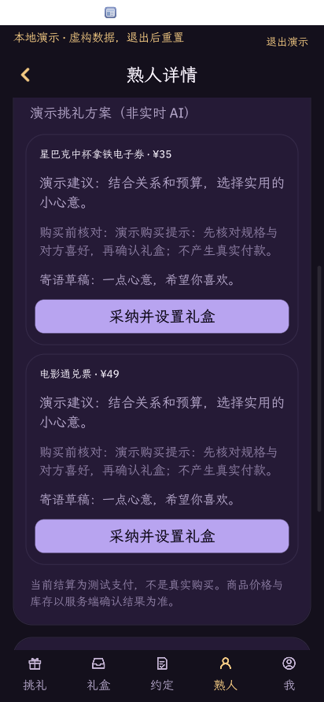
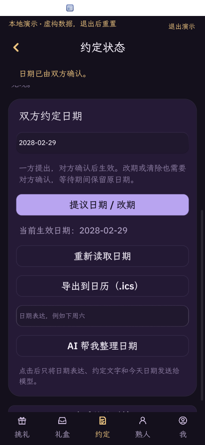

## 1.0.40 AI 数据预览（2026-10-10，未发布）

挑礼首页增加 AI 入口。刷新服务器资料后先预览发送内容，用户确认才调用 model.complete；关系/完整备注默认排除，可明确加入；熟人编号、姓名、联系方式和完整日期不作为资料字段发送。用户场景与已选备注中的个人信息仍按原文发送，界面和隐私文档说明该边界。候选商品是独立备选，单件预算不代表组合总价。

生产函数在标准 card-host 执行 35 项发送/取消/过期条件/登录状态/载荷检查（显式合成模型适配器），另有22项购买与日期守卫、23项演示检查通过。窄屏412×892实测首页入口→熟人→预览→取消→重新预览→演示生成，发送和取消按钮固定显示；实际捕获见 [预览截图](../screenshots/ai-data-preview-demo.png)。UI 检查使用同一 main.splash 的本地演示渲染副本，移除 card-host 不支持的原生 API 要求，仅用于检查界面；不代表完整原生登录或真实模型验收。1.0.39 的真实 MiniMax 记录仍属历史证据，不宣称本版本新载荷已经真实推理验证。

## 1.0.37 功能验证（2026-10-09，未发布）

按 App Hub 现有评分证据改进可执行的 AI 购买建议、下单结果核验和双方约定日期。服务端配套版本见 verification/server-revision.txt。两仓库均使用 Apache-2.0。

隔离 PostgreSQL 的完整检查通过：40 个 Rust 测试、65 个授权 HTTP 检查、65 个心愿单检查、58 个个人兑现状态检查、128 个购买/双方日期/日历检查，以及两组固定验证码回退检查。个人兑现状态不受共享日期影响。日期覆盖自确认拒绝、第三方拒绝、过期版本拒绝、改期待确认保留旧日期、撤回、双方确认清除；日历覆盖文本转义、UTF-8 行折叠、失效会话、密钥重放及日期变更。

干净标准 card-host 执行本地演示 23 项和 AI/购买守卫 22 项。后者使用合成模型输出，验证未知商品、预算、重复候选及过期上下文等约束，不代表真实模型推理已验证。模型不可用时提示不可用；推荐采用后仍需用户确认测试下单。日历为 .ics 手动导入，不是自动同步，不声明 Apple/Google/Outlook 导入成功。

复现新增守卫：设置 OCTO_HUB 与 OCTO_CARD_HOST 为标准运行器后执行 `python3 scripts/check-ai-purchase.py`；后端使用一次性测试数据库运行 `python3 tests/run_ci.py`。标准运行器的完整界面检查已走通本地演示的推荐采纳、报价确认、支付/订单/配置读回，以及日期提议和模拟对方确认；截图为真实捕获，演示标签保留。完整公网双账号 GUI 和真实模型流程仍待运营者在配置好的宿主验证。





---

## 1.0.36 发布更新（2026-10-09）

正式后端配置为 `https://liyu.taidge.com`，唯一允许主机为 `liyu.taidge.com`。检查源码 bundle 使用先前锁定的标准运行器，关卡通过且本地演示 23 项检查通过，8 张商品图，源码包仍低于 8 MB。首次发布核查时公网 `/health` 返回 523；随后运营者完成部署，2026-10-09 再次核查返回 HTTP 200 和 status=ok。该补充只验证健康接口，不把完整公网注册/登录流程标记为已验证。

发布工作流由 App Flow `049bc6b4010aa3660bab4ad632857d6ed4612151` 的 `tools/octo publish-github` 生成，发布工具链固定 App Hub `655114c4943cd2490daaefa2173e7b5aaa20669f`。这与下面记录的源码运行器基线是两套不同用途的版本。工作流通过后下载 Release 中的 `app.bundle.pack.json`；安装封装包需要支持 publisher-github-v1 的宿主。未完成兼容 Store 的本应用安装核验前，不声明已经入库或完整商店安装验证。

配套后端 v0.1.1 增加无 Caddy 的 compose.deploy.yaml，配置已验证仅有 db/server、回环服务端口及 production 保护；业务 API 未改变。下面记录的 38 单元/188 HTTP 及完整 UI 证据属于原验证基线，不把本次域名更新当作公网端到端验证。

---

# 版本、证据与复现

## 如何对应同一个版本

小程序的 `verification/server-revision.txt` 固定配套服务端提交。CI 从提交后的干净检出校验包内路径、八张演示图片、8 MB 上限、服务域名、能力与 BLAKE3 完整性，不修改清单，也不重新盖章掩盖过期摘要。

CI 生成 ZIP 和 `verification.json`，包含小程序提交 SHA、配套服务端 SHA、应用版本、包 BLAKE3、ZIP SHA256 及工作目录是否有修改。Windows、Linux、macOS 任务都只验证打包；它们通过不代表这些系统上的图形运行或模型功能已验证。ZIP 是未签名的检查材料，不是完成平台审批的发行包。

下载 Actions 的对应提交 artifact，核对 `verification.json` 后计算 ZIP 的 SHA256。包内清单的完整性还应交给标准 `hub check` 验证；数字签名需由发布者按官方流程完成。不要把 `main` 的浮动内容当成固定版本。

## 从干净检出复现

```sh
git clone https://github.com/chrislearn/liyu-mini.git
cd liyu-mini
# 使用 Actions 记录中的 source_revision 替换下列值
git checkout <小程序提交SHA>
python3 -m venv build/verify-venv
build/verify-venv/bin/python -m pip install --require-hashes --only-binary=:all: -r scripts/ci-requirements.txt
build/verify-venv/bin/python scripts/check-bundle.py
```

Windows 的虚拟环境 Python 为 `build/verify-venv/Scripts/python.exe`。获取标准运行器按 [官方 Quickstart](https://github.com/OctoSense-org/OctoScript-App-Design-Flow/blob/main/docs/QUICKSTART.md)，记录运行器和框架的提交、二进制摘要，确认源码无修改；不要使用未公开的专用 LIYU 宿主补丁。

1. 标准运行器打开 `bundle`，点击「本地演示」。无需后端或模型，检查送出礼盒、必须主动打开、猜错不揭晓、答对后收到礼物、钱包流水与多商品心愿单。自动检查可运行 `python3 scripts/check-local-demo.py`。
2. 检出 `verification/server-revision.txt` 所指服务端，按其部署指南启动 Compose 并信任自己生成的 Caddy CA。配置的后端域名必须与小程序允许列表一致。
3. 使用自己的测试账号在授权网页登录并确认；取消授权不得登录。浏览商品和熟人、送礼、由另一测试账号拆盒，并退出登录验证会话撤销。`python3 scripts/check-net.py` 单独验证实际请求函数的标准 HTTPS 商品读取。
4. 运行服务端 `tests/run_ci.py`：一次性数据库验证授权、心愿单隐私及并发、个人约定状态。此检查不代替两个账号在图形界面的完整交互。

## 当前验证范围

2026-10-08：本机 macOS Apple Silicon 已完成本地演示 23 项检查、标准 HTTPS 商品读取、应用包校验；服务端完成 38 个 Rust 测试、65 项授权、65 项心愿单及 58 项约定接口检查，容器 HTTPS、管理后台、图片与生产测试账号拒绝已通过。

**早期图形截图和运行检查来自作者机器，当时 App Hub 源码有未提交修改。** 当时的提交与二进制 SHA256 记录在 `verification/author-runtime.json`。本轮另用官方准备工具锁定运行时，从干净的 App Hub 与框架源码编译，验证了 23 项演示检查、HTTPS 商品读取及应用启动／授权请求取消；提交与二进制摘要见 `verification/standard-runtime.json`。这些新增结果仍来自作者机器，未冒充第三方图形审查。这些结果不证明官方运行器干净检出或其他平台兼容。现有网页授权测试为 HTTP/API 自动化；完整图形跨账号流程仍应按上面的清单独立复核，不能与 API 结果混算。本仓库未声称双环独立审查通过、苹果公证通过或 Windows/Linux 图形运行通过。

本轮包 CI 与 API CI 提供独立机器的检查记录，但图形运行、平台认证、真实供应商／支付仍各有自己的验证范围。复现后附提交 SHA、运行环境、命令、结果和实际截图，不引用其他项目的测试结果。

校验工具的 Python 包固定版本及 PyPI wheel SHA256，安装使用 `--require-hashes --only-binary`，不构建源码安装包。CI Actions 也固定到提交 SHA。小程序自身不下载或执行 agent 程序，不需要其进程启动权限。

### 复现本轮干净标准运行器

使用 `verification/standard-runtime.json` 中 App Hub 与 `preparation_tool` 的提交，按官方 Quickstart 克隆 App Hub 与设计流程仓库并分别检出记录中的版本。在设计流程仓库运行：

```sh
python3 tools/setup-native.py --root <隔离工作目录> --cache <可选本机源码缓存>
python3 tools/setup-native.py --root <隔离工作目录> --check
cargo build --locked --manifest-path <隔离工作目录>/OctoSense-App-Hub/Cargo.toml -p octosense-app-hub -p octosense-card-host
```

四个运行时仓库均应 `git status --porcelain` 无输出，并与记录提交对应。在小程序仓库将 `OCTO_HUB` 与 `OCTO_CARD_HOST` 指向新编译的两个二进制，再执行演示和网络检查脚本。网络检查需要可信 HTTPS 后端。缓存仅用于取得已有 Git 对象，不使用缓存中的未提交源码。

本轮以 App Hub 和官方准备工具锁定版本为基准，不表示最新完整 OctoSense 宿主已验证。
